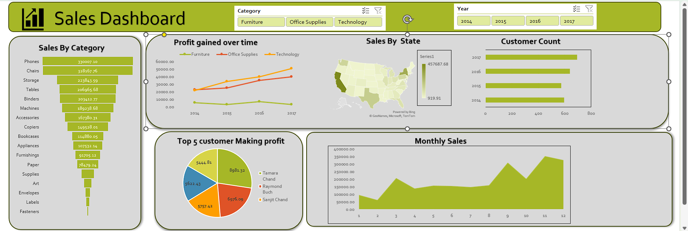

# 🧾 Sales Dashboard

This project presents an **interactive Sales Dashboard** built using **Microsoft Excel**, designed to analyze and visualize key business metrics such as **sales, profit, and customer performance** across different categories and years.

---

## 📊 Project Overview

The goal of this dashboard is to provide an insightful overview of sales performance to support better business decisions.
It visualizes data across multiple dimensions — **Category**, **Year**, **Customer**, and **Region** — allowing users to explore and understand trends effectively.

---

## 🚀 Key Insights

* **Sales by Category:** Highlighted top-performing product categories such as Phones and Chairs.
* **Profit Over Time:** Showed profit trends from 2014 to 2017 for Furniture, Office Supplies, and Technology.
* **Customer Analysis:** Identified top 5 customers generating the highest profit.
* **Regional Sales:** Mapped sales distribution across different U.S. states.
* **Monthly Trends:** Visualized monthly sales fluctuations to observe seasonal performance.

---

## ⚙️ Tools & Techniques

* **Microsoft Excel**

  * Pivot Tables & Charts
  * Slicers and Timelines for interactive filtering
  * Power Map for geographical visualization
  * Data Cleaning and Aggregation

---

## 📈 Dashboard Preview

---

## 💡 Learnings

* Improved understanding of **data visualization and storytelling** in Excel.
* Strengthened skills in **data aggregation, trend analysis, and dynamic reporting**.
* Learned to design clean, insight-driven dashboards for business use cases.

---

## 🧠 Author

**Rohit Raj**
💼 Aspiring Data Analyst | Passionate about turning data into actionable insights
🔗 [LinkedIn Profile](https://www.linkedin.com/in/rohit-raj-980416267/)

---

## 🗂️ Project Tags

`#DataAnalysis` `#ExcelDashboard` `#SalesAnalytics` `#DataVisualization` `#BusinessInsights`
